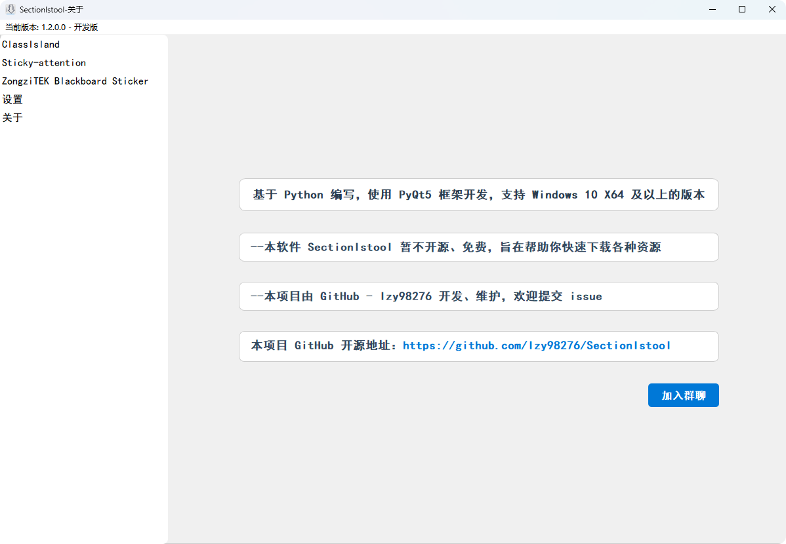
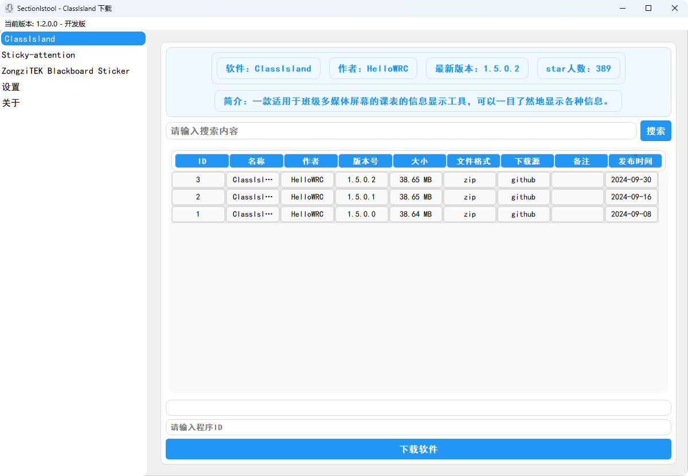

<image src="resources/SectionIstool_icon.png" height="128"/>

# SectionIstool

该软件会使您在学校班级电脑中方便、快捷的下载适合班级下载各类软件

| 下载 [Releases](https://github.com/SectionIstool/SectionIstool/releases) |

> [!important]
> **此项目仍在早期开发中，使用过程中可能会遇到一些未知的问题！**
> **如果您有任何建议或意见，欢迎提交 [Issue](https://github.com/SectionIstool/SectionIstool/issues)！**

> [!tip]
> **该软件更新缓慢 <1.3.0.0> 版本更换软件界面、主要逻辑等方面**

## 功能
### 主要功能
- [ ] SectionIstool 插件式程序对应需求下载
- [ ] 支持全部的 <班级一体机的优质软件> 的下载、更新(更新功能根据实际情况而定)
- [ ] 支持导出、导入配置文件(一键下载对应软件)
- [ ] 支持自动更新(根据实际情况而定)
- [ ] 支持软件的卸载

### 设置功能
- [ ] 设置界面支持设置、修改软件的大部分功能

## Stars 历史

如果这个项目对您有帮助，请点亮 Star ⭐

## 软件截图 - 1.2.0.0

## License

