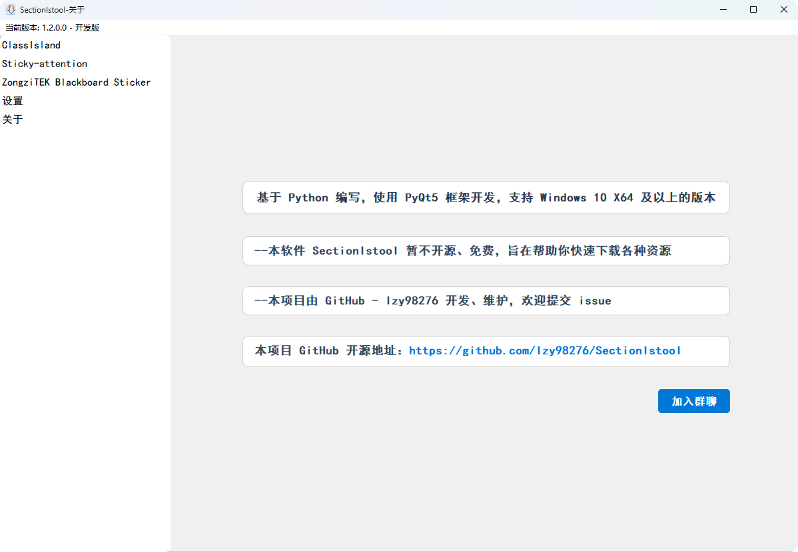
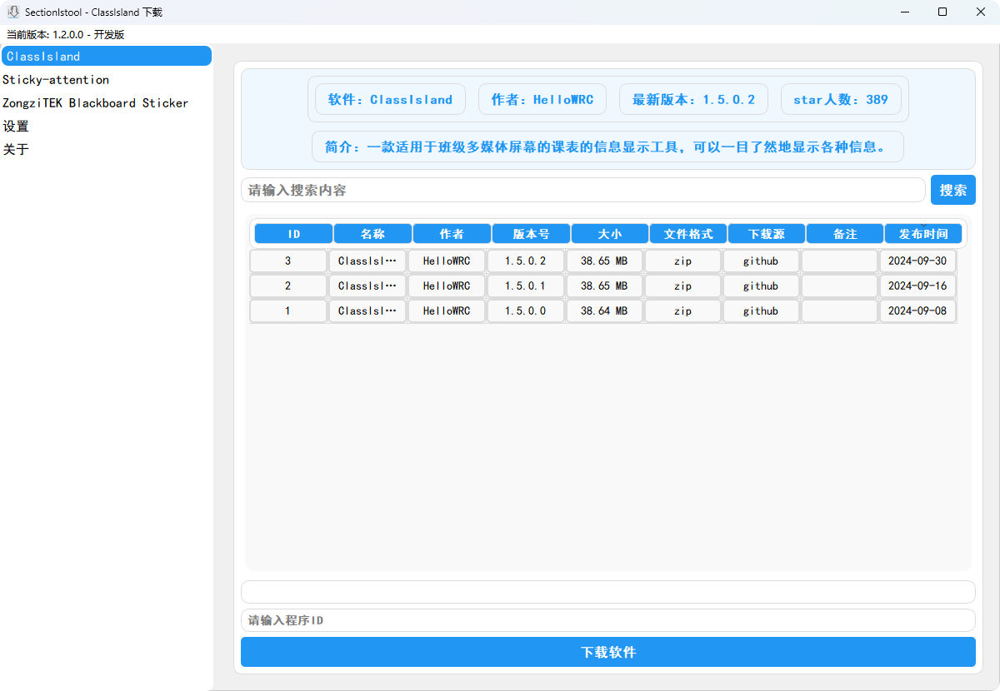

<image src="resources/SectionIstool_icon.png" height="128"/>

# SectionIstool

在学校班级电脑中方便、快捷的下载适合班级使用的各类软件

| 下载 [Realeases](https://github.com/lzy98276/SectionIstool/releases) |

> [!important]
> **此项目仍在早期开发中，使用过程中可能会遇到一些未知的问题！**

## 功能
### 下载功能
- [X] 自动获取已适配推荐的软件
- [X] 方便、快速的下载软件
- [ ] 自定义添加Github项目
### 自动安装
- [ ] 自动安装已完成下载的软件 (该软件需在下载功能中下载的文件)
- [ ] 自动安装已适配的软件
### 设置
- [X] 自定义下载位置
- [ ] 自定义程序的安装位置
- [ ] 自动更新
### 其它功能
- [X] 体积小巧
- [X] 界面美观
- [X] 亮色主题
- [X] 使用方便

## Stars 历史

如果这个项目对您有帮助，请点亮 Star ⭐

## License
7656
